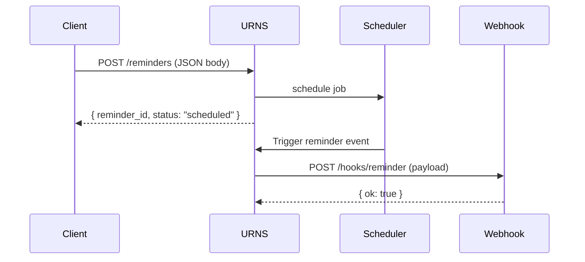

# URNS Microservice — Communication Contract

This document defines the **fixed API contract** for the Universal Reminder & Notification Service (URNS).  

---

## 1. Overview

URNS supports:

- Scheduling **one-time reminders**
- Scheduling **recurring (cron)** reminders
- Listing scheduled reminders
- Deleting reminders
- Sending reminder events to a **webhook** provided by the client

All communication uses **JSON over HTTP**.

---

## 2. Requesting Data from URNS

All requests **must include**:

```
X-App-Key: dev-key
Content-Type: application/json
```

URNs rejects any request missing `X-App-Key`.

---

## 2.1 Create a Reminder  
**POST /reminders**

### Headers
```
X-App-Key: dev-key
Content-Type: application/json
```

### One-Time Reminder (type = time)

**Request body:**
```json
{
  "app_id": "weather-app",
  "type": "time",
  "when": "2025-12-01T07:00:00Z",
  "notify": {
    "webhook": "http://127.0.0.1:8080/hooks/reminder"
  },
  "payload": {
    "title": "Daily Forecast"
  }
}
```

### Recurring Reminder (type = cron)

```json
{
  "app_id": "weather-app",
  "type": "cron",
  "cron": "0 7 * * *",
  "notify": {
    "webhook": "http://127.0.0.1:8080/hooks/reminder"
  },
  "payload": {
    "title": "Daily Forecast"
  }
}
```

### Success Response
```json
{
  "reminder_id": "uuid-string",
  "status": "scheduled"
}
```

### Example (curl)

```bash
curl -X POST http://127.0.0.1:8081/reminders \
  -H "Content-Type: application/json" \
  -H "X-App-Key: dev-key" \
  -d '{
    "app_id": "weather-app",
    "type": "time",
    "when": "2025-12-01T07:00:00Z",
    "notify": { "webhook": "http://127.0.0.1:8080/hooks/reminder" }
  }'
```

---

## 2.2 List All Reminders  
**GET /reminders**

### Headers
```
X-App-Key: dev-key
```

### Success Response
```json
[
  {
    "reminder_id": "8049e7...",
    "app_id": "weather-app",
    "type": "cron",
    "cron": "0 7 * * *",
    "status": "scheduled",
    "attempts": 1,
    "next_run_time": "2025-11-02T07:00:00Z",
    "payload": { "title": "Daily Forecast" }
  }
]
```

### Example
```bash
curl -H "X-App-Key: dev-key" http://127.0.0.1:8081/reminders
```

---

## 2.3 Get a Single Reminder  
**GET /reminders/{reminder_id}**

Example:
```
GET /reminders/8049e7a9-284d
```

---

## 2.4 Delete a Reminder  
**DELETE /reminders/{reminder_id}**

```bash
curl -X DELETE \
  -H "X-App-Key: dev-key" \
  http://127.0.0.1:8081/reminders/8049e7a9-284d
```

Response:
```json
{
  "status": "cancelled",
  "reminder_id": "8049e7a9-284d"
}
```

---

## 2.5 Delete All Reminders  
**DELETE /reminders**

```bash
curl -X DELETE -H "X-App-Key: dev-key" http://127.0.0.1:8081/reminders
```

Response:
```json
{ "status": "cleared" }
```

---

## 3. Receiving Data from URNS (Webhook)

URNS delivers reminders by sending an HTTP POST to the webhook your application specifies.

Your app **must** expose:

```
POST /hooks/reminder
```

### Example Webhook Payload
```json
{
  "reminder_id": "8049e7a9-284d",
  "app_id": "weather-app",
  "fired_at": "2025-11-02T07:00:00Z",
  "payload": {
    "title": "Daily Forecast"
  }
}
```

### Headers URNS Sends
```
Content-Type: application/json
X-App-Id: <your app id>
X-URNS-Delivery: <attempt number>
X-App-Key: dev-key
```

---

### Example Receiver (FastAPI)

```python
from fastapi import FastAPI

app = FastAPI()

@app.post("/hooks/reminder")
async def receive_reminder(event: dict):
    print("Reminder received:", event)
    return {"ok": true}
```

---

## 4. UML Sequence Diagram (Mermaid)



---

## End of Communication Contract
